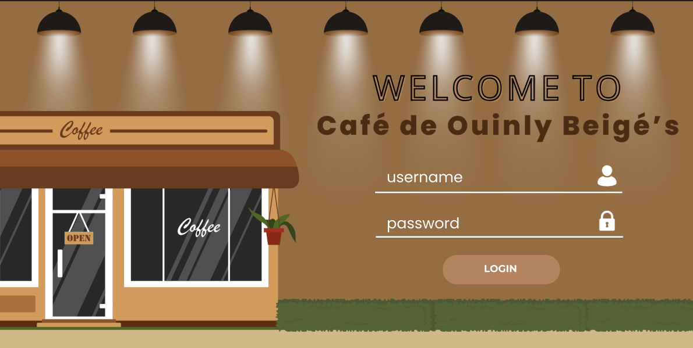

# Point-of-Sale-System

☕ Point of Sale (POS) System

The POS System is a lightweight point-of-sale app designed for cafés. It focuses only on ordering and checkout for three categories of products: Hot Drinks, Cold Drinks, and Pastries.

📖 Overview

This POS system was developed as a basic cashiering tool to let staff quickly select items, calculate totals, and process customer payments. 

✨ Key Features

1. Product Categories:

- ☕ Hot Drinks (e.g., Americano, Cappuccino, Latte)

- 🧊 Cold Drinks (e.g., Iced Coffee, Frappes, Smoothies)

- 🥐 Pastries (e.g., Croissants, Muffins, Cakes)

2. Order Screen: Select products and quantities.

3. Checkout: Automatically calculates total amount, accepts tendered cash, and shows change.

4. Receipts: Simple breakdown of items and prices.

# File

[POS System (PDF)](./Point-of-Sale-System.pdf)

# POS Preview

